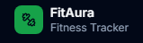
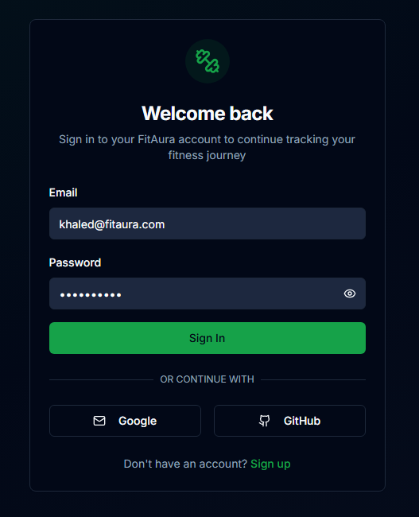
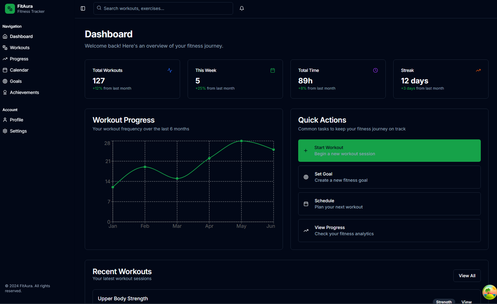
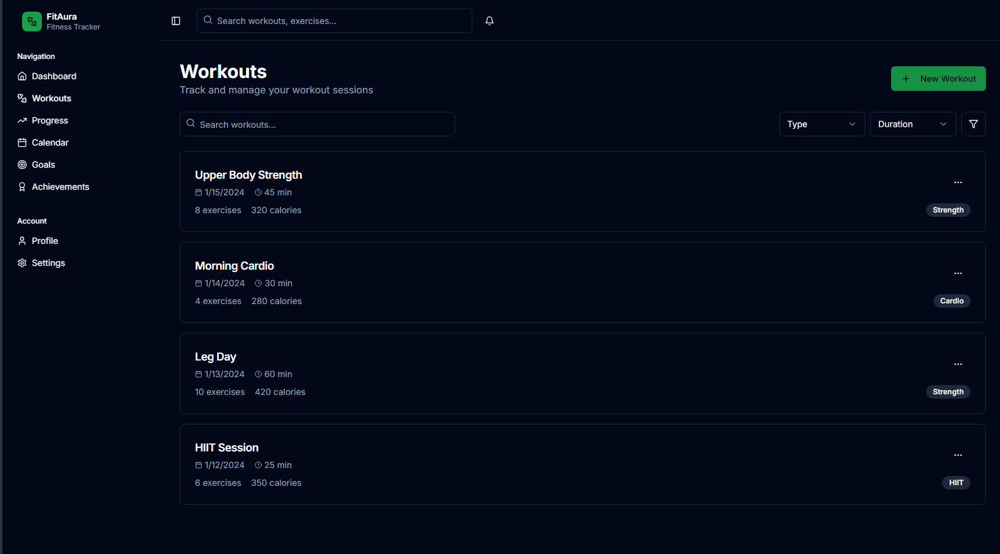
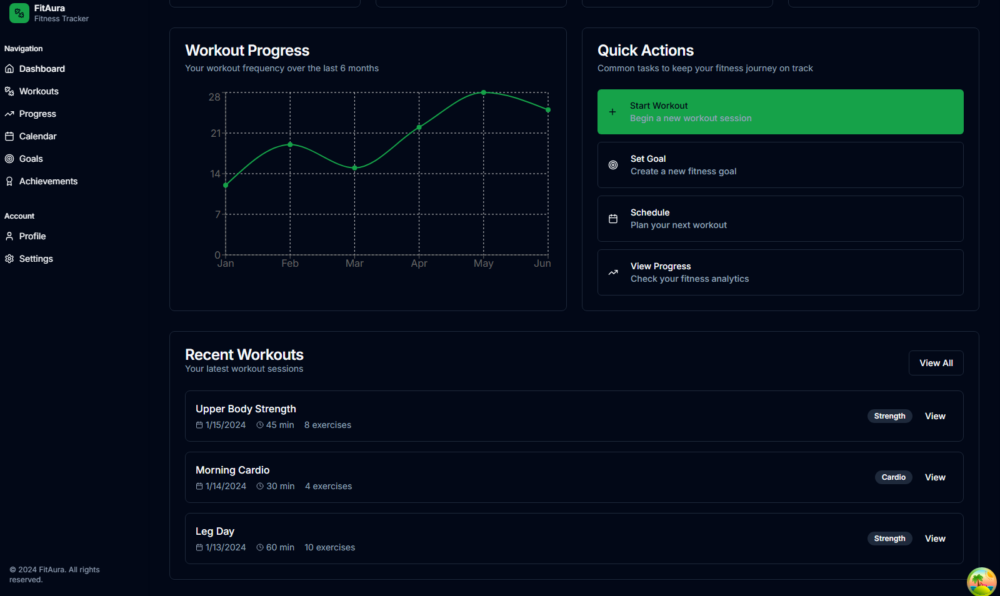
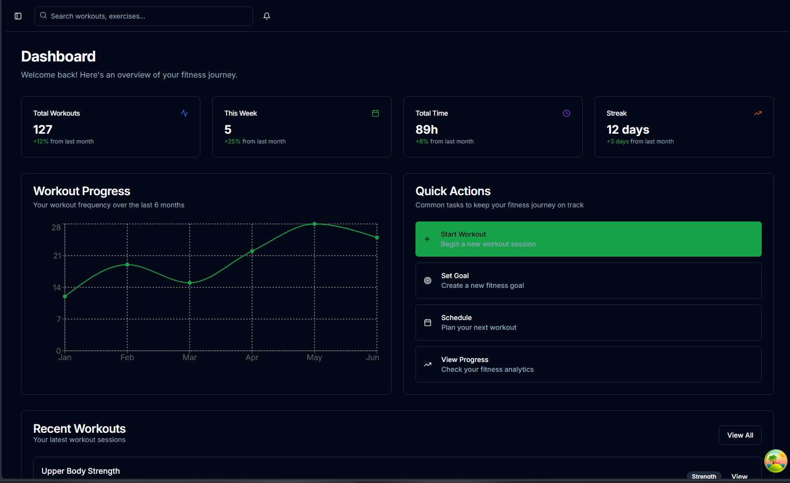

# FitAura - Modern Fitness Tracking Platform

<div align="center">


  
  **Transform Your Fitness Journey with Modern Technology**
  
  [](https://nextjs.org/)
  [](https://www.typescriptlang.org/)
  [](https://tailwindcss.com/)
  [](https://www.prisma.io/)
  [](https://vercel.com/)
</div>

## 🏋️ Overview

FitAura is a comprehensive fitness tracking web application built with modern technologies. This is a complete rewrite and modernization of the original FitAura project, migrating from vanilla HTML/CSS/JS + Express to a full-stack Next.js application.

### ✨ Key Features

- **🔐 Authentication**: NextAuth.js with email/password + OAuth (Google, GitHub)
- **📊 Workout Logging**: Comprehensive exercise tracking with sets, reps, weights, and duration
- **📈 Progress Dashboard**: Visual analytics with charts and performance metrics
- **🎯 Goal Setting**: Set and track fitness goals with progress monitoring
- **🏆 Achievements**: Unlock achievements based on workout milestones
- **📱 Responsive Design**: Mobile-first approach with full accessibility support
- **🌙 Dark Mode**: System-aware theme switching
- **⚡ Performance**: Optimized with Next.js 14 App Router and SSR/SSG

## 🚀 Quick Start

### Prerequisites

- **Node.js** 18.17 or later
- **npm** or **yarn** or **pnpm**
- **Git**
- **PostgreSQL** (for production) or **SQLite** (for development)

### Installation

1. **Clone the repository**
   ```bash
   git clone https://github.com/THEKINGSTAR/FitAura.git
   cd FitAura
   ```

2. **Install dependencies**
   ```bash
   npm install
   # or
   yarn install
   # or
   pnpm install
   ```

3. **Set up environment variables**
   ```bash
   cp .env.example .env.local
   ```

4. **Configure your environment variables** (see [Environment Variables](#environment-variables))

5. **Set up the database**
   ```bash
   # Generate Prisma client
   npx prisma generate
   
   # Push schema to database
   npx prisma db push
   
   # (Optional) Seed the database
   npx prisma db seed
   ```

6. **Start the development server**
   ```bash
   npm run dev
   ```

7. **Open your browser**
   Navigate to [http://localhost:3000](http://localhost:3000)


## 🎯 **What You Can Do Now**

1. **Clone the repo** to get the complete project
2. **Follow the README instructions** to set up locally
3. **Customize the design** and add your own features

The project includes everything from the original requirements:
- ✅ **Next.js 14 + TypeScript**
- ✅ **Authentication with NextAuth.js**
- ✅ **Tailwind CSS + shadcn/ui**
- ✅ **Database with Prisma**
- ✅ **Responsive dashboard**
- ✅ **Testing setup**
- ✅ **Deployment ready**


<div align="center">














</div>
